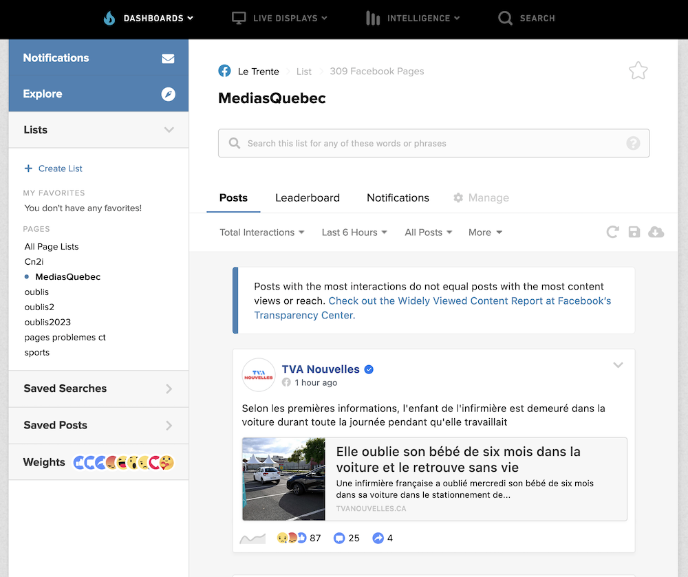
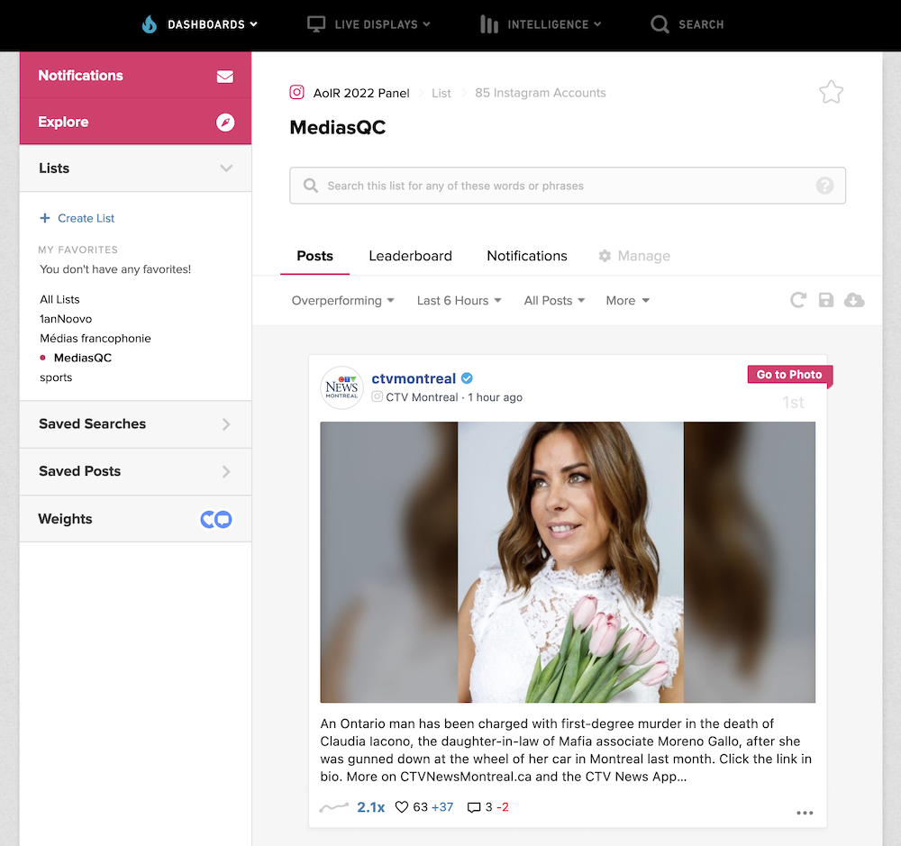

# Médias du Québec et réseaux sociaux (Facebook, Instagram et TikTok), 2011-2023

Code et données utilisées pour un article sur la présence des médias québécois dans trois réseaux sociaux (Facebook, Instagram et TikTok) publié dans *Le Trente*, magazine annuel de la [Fédération professionnelle des journalistes du Québec (FPJQ)](https://www.fpjq.org/fr/).

## Méthodologie

De façon générale, pour Facebook et Instagram, l’extraction de données a été effectuée grâce à CrowdTangle, un outil d’analyse des contenus de Meta Platforms.

Pour TikTok, un script en langage python a permis d’utiliser le module TikAPI. L’extraction a été effectuée au printemps 2023 et complétée le 5 juin. 

* Sur Facebook, l’extraction concerne 309 pages de médias québécois;
* sur Instagram, 85 comptes et
* sur TikTok, 24 comptes. 

### Facebook et Instagram

Les données sur les contenus journalistiques québécois dans Facebook et Instagram ont été obtenues à partir de deux tableaux de bord créés dans [CrowdTangle](https://www.crowdtangle.com/), un outil d'analyse de contenus appartenant à Meta Platforms, la société mère des deux réseaux sociaux. Dans ces tableaux de bord, deux listes ont été créées:
* une liste de 309 pages Facebook médiatiques appelée MediasQuebec
* une liste de 85 comptes Instagram médiatiques appelée MediasQC

J'ai ensuite demandé à CrowdTangle de me fournir toutes les publications qu'il contient et qui ont été faites par les 309 pages Facebook et les 85 comptes Instagram identifiés entre le 1er janvier 2011 et le 31 mai 2023.

* Pour Facebook, CrowdTangle a retourné 60 fichiers différents contenant en tout **4&nbsp;549&nbsp;559 publications**.
* Pour Instagram, CrowdTangle a retourné 15 fichiers différents contenant en tout **140&nbsp;542 publications**.

Un premier traitement de l'ensemble de ces fichiers a été effectué à l'aide de [pandas](https://pandas.pydata.org/docs/), module python d'analyse de données. Les carnets qui détaillent cette première étape sont accessibles dans ce répertoire:
* [**FB_300médias_parMois.ipynb**](FB_300médias_parMois.ipynb)
* [**IG_85_médias_parMois.ipynb**](IG_85_médias_parMois.ipynb)

J'ai ensuite extrait les publications des 17 mois s'échelonnant du 1er janvier 2022 au 31 mai 2023 et les ai analysées, notamment à l'aide du module de traitement du langage naturel [spacy](https://spacy.io/), dans deux autres carnets:
* [**FB_Analyse_2022-23.ipynb**](FB_Analyse_2022-23.ipynb)
* [**IG_Analyse_2022-23.ipynb**](IG_Analyse_2022-23.ipynb)

### TikTok

Pour recueillir les métadonnées des vidéos diffusées par les médias du Québec dans TikTok, l'API [TikAPI](https://tikapi.io/) ($) a été utilisée. Ce moissonnage a été effectué en trois étapes.

#### Échantillonnage ❄️

La méthode d'échantillonnage [boule de neige](https://fr.wikipedia.org/wiki/%C3%89chantillonnage_boule_de_neige) a été utilisée. À partir de comptes préalablement identifiés, comme ceux de certains médias ([@tvanouvelles](https://www.tiktok.com/@tvanouvelles), [@ledevoir](https://www.tiktok.com/@ledevoir), etc.) ou de certaines organisations qui ont à traiter régulièrement avec des médias ([@quebecsolidaire](https://www.tiktok.com/@quebecsolidaire), [@uqam](https://www.tiktok.com/@uqam), etc.), un premier script fouille dans la liste des autres comptes TikTok qui sont suivis par ce compte afin d'identifier des comptes de médias:
* [**tt0-following.py**](tt0-following.py)

#### Détails des comptes médiatiques

Une fois les comptes de médias établie, un deuxième script va chercher des métadonnées sur ces comptes. À noter que j'ai ajouté des médias européens dans ce script pour d'autres projets de recherche:
* [**tt1-comptes.py**](tt1-comptes.py)

#### Détails des vidéos

À partir des métadonnées de base sur les comptes qui nous intéressent, ce troisième script recueille des données sur toutes les vidéos diffusées dans TikTok par ces comptes depuis qu'ils y sont abonnés.
* [**tt2-videos.py**](tt2-videos.py)

Une analyse textuelle a également été effectuée sur un sous-ensemble composé des publications TikTok diffusées en 2022 et en 2023 (jusqu'au 31 mai 2023). Elle est décrite dans ce carnet:
* [**TT_Analyse_2022-23.ipynb**](TT_Analyse_2022-23.ipynb)

## Données

### Facebook

Les [conditions d'utilisation](https://www.crowdtangle.com/terms) de CrowdTangle ne me permettent pas de rendre accessible l'ensemble des données colligées. Je demeure ouvert à les faire parvenir à toute personne chercheuse qui [m'en ferait la demande](mailto:roy.jean-hugues@uqam.ca) dans le cadre d'un projet de recherche (s'applique aussi aux personnes étudiantes aux cycles supérieurs à l'université).

Je peux cependant donner accès à ces données agrégées qui donne une idée de l'activité Facebook d'un peu plus de 300 pages de médias québécois entre le 1er janvier 2022 et le 31 mai 2023:

* [**Facebook_medias_quebec_2022-2023.csv**](Facebook_medias_quebec_2022-2023.csv)

### Instagram

Les conditions d'utilisation de CrowdTangle s'appliquent également à mon corpus Instagram. Je suis disposé à y donner accès, mais sur demande seulement.

Et je peux donner accès à l'agrégation présentée dans le fichier CSV suivant, qui donne une idée de l'activité Instagram d'un peu plus de 80 comptes de médias québécois entre le 1er janvier 2022 et le 31 mai 2023:

* [**Instagram_medias_quebec_2022-2023.csv**](Instagram_medias_quebec_2022-2023.csv)

### TikTok

Je n'ai pas les même restrictions avec TikTok. Je peux rendre accessible l'ensemble des données que j'ai récoltées grâce à la métho décrite ci-dessus dans le fichier suivant:

* [**TikTok_medias_quebec_2019-2023.csv**](TikTok_medias_quebec_2019-2023.csv)

## Informations supplémentaires

L'espace restreint dans *Le Trente* a conduit à supprimer plusieurs tableaux que j'avais réalisés pour accompagner cet article.

Tableau 1 - Médias québécois sur **TikTok**, par nombre moyen de vues par vidéo.

| Média      | Nombre de vidéos | Nombre de vues | Vues par vidéo |
|--------------------|-----------------:|---------------:|---------------:|
| @rds.ca    | 355      | 34&nbsp;150&nbsp;656   | 96&nbsp;199    |
| @tvasports   | 127      | 8&nbsp;982&nbsp;792    | 70&nbsp;731    |
| @tvanouvelles  | 238      | 13&nbsp;404&nbsp;200   | 56&nbsp;320    |
| @lesacdechips  | 107      | 5&nbsp;802&nbsp;452    | 54&nbsp;229    |
| @_urbania    | 346      | 15&nbsp;170&nbsp;617   | 43&nbsp;846    |
| @lapochebleue  | 100      | 4&nbsp;192&nbsp;005    | 41&nbsp;920    |
| @mtlblog     | 580      | 24&nbsp;071&nbsp;769   | 41&nbsp;503    |
| @24heuresca    | 263      | 9&nbsp;529&nbsp;778    | 36&nbsp;235    |
| @majmonactu    | 113      | 3&nbsp;737&nbsp;001    | 33&nbsp;071    |
| @radio.canada.info | 223      | 6&nbsp;038&nbsp;150    | 27&nbsp;077    |

---

Tableau 2 - Catégorisation des 100 mots-clics les plus couramment utilisés sur **TikTok** par les médias québécois.

| Catégorie de mot-clic | Exemples                   | Nb de mentions |
|-----------------------|----------------------------------------------------------------|---------------:|
| Localisation    | #MTL, #514, #québec, #sherbrooke, etc.         |     4&nbsp;480 |
| Propre à TT     | #tiktokquebec, #quebectiktok, #fyp, #pourtoipage, etc.   |     2&nbsp;825 |
| Sujet précis    | #hockey, #nhl, #lnh, #ukraine, #climat, #françoislegault, etc. |     1&nbsp;897 |
| Autoréférentiel   | #narcityquebec, #tvanouvelles, #ledevoir, etc.       |     1&nbsp;377 |
| Sujet vague     | #actualité, #news, #voxpop, #sports, #humour, etc.     |     1&nbsp;132 |

---

Tableau 3 - Données de base sur 15 comptes **Instagram** de médias québécois (nombre de followers, de publications, de vues et d’interactions), classés en fonction du nombre d’interactions (commentaires + _likes_) par publication (janvier 2022 à mai 2023).

| **Média**  | **_Followers_ maximum** | **Albums** | **Photos** | **Vidéos** | **Vues** | **Vues moyennes** | **Commentaires** | **_Likes_** | **Interactions moyennes** |
|---------|------------------:|-----------------:|-----------:|-----------:|---------:|------------------:|-----------------:|----------:|--------------------------:|
| Rad    |  105&nbsp;491 |  406 |  1 | 11 |  1&nbsp;921&nbsp;040 |  4&nbsp;607 |  21&nbsp;208 | 1&nbsp;154&nbsp;503 |    2&nbsp;813 |
| RDS    |  123&nbsp;929 |    471 |   3&nbsp;597 |    201 |  7&nbsp;469&nbsp;861 |     11&nbsp;116 |    73&nbsp;526 | 6&nbsp;594&nbsp;962 |        1&nbsp;562 |
| TVA Nouvelles      |    152&nbsp;242 |      303 |    141 |   87 |  6&nbsp;611&nbsp;697 |     16&nbsp;953 |    37&nbsp;851 |  498&nbsp;875 |        1&nbsp;011 |
| TVA Sports       |     54&nbsp;120 |      136 |    851 |    228 | 918&nbsp;963 |      2525 |    17&nbsp;482 |  928&nbsp;290 |         778 |
| _URBANIA_        |     80&nbsp;774 |      236 |   73 |    163 |  5&nbsp;677&nbsp;126 |     14&nbsp;228 |     9&nbsp;602 |  349&nbsp;308 |         760 |
| _Le Devoir_      |    135&nbsp;010 |     1&nbsp;170 |   1&nbsp;207 |    101 |  2&nbsp;134&nbsp;280 |      1&nbsp;679 |    38&nbsp;759 | 1&nbsp;400&nbsp;016 |         581 |
| Radio-Canada Information |    211&nbsp;273 |     1&nbsp;104 |   57 |   86 |  1&nbsp;915&nbsp;122 |      1&nbsp;609 |    19&nbsp;240 |  658&nbsp;635 |         544 |
| _La Presse_      |    179&nbsp;474 |      510 |   85 |   20 | 644&nbsp;119 |      1&nbsp;215 |    10&nbsp;353 |  312&nbsp;898 |         526 |
| CBC Montreal     |     49&nbsp;873 |      244 |    176 |   76 | 919&nbsp;888 |      2&nbsp;875 |    12&nbsp;817 |  239&nbsp;561 |         509 |
| _Le Journal de Montréal_   |     93&nbsp;613 |      118 |    888 |    5 | 123&nbsp;548 |      1&nbsp;004 |    40&nbsp;205 |  469&nbsp;144 |         504 |
| Radio-Canada Environnement |     19&nbsp;693 |      267 |   16 |   61 | 468&nbsp;812 |      1&nbsp;429 |     3&nbsp;121 |  160&nbsp;578 |         476 |
| _Montreal Gazette_     |     75&nbsp;456 |      198 |   1&nbsp;570 |    2 |  28&nbsp;188 |     141 |    64&nbsp;015 |  774&nbsp;360 |         474 |
| Radio-Canada Science   |     30&nbsp;142 |      196 |   72 |   42 | 346&nbsp;047 |      1&nbsp;454 |     2&nbsp;506 |  115&nbsp;342 |         380 |
| _Narcity Québec_     |    184&nbsp;098 |      380 |   6&nbsp;784 |    8 | 501&nbsp;995 |      1&nbsp;294 |     108&nbsp;074 | 2&nbsp;601&nbsp;118 |         378 |
| _24 heures_      |     14&nbsp;956 |      544 |   69 |   65 | 404&nbsp;214 |     664 |     5&nbsp;114 |  209&nbsp;744 |         317 |

---

Tableau 4 - 20 mots-clics les plus souvent mentionnés sur **Instagram** par les médias québécois (2022-2023)

| **Mot-clic**            | **Nombre de mentions** |
|-------------------------|-----------------------:|
| #polqc                  |                   1&nbsp;248 |
| #environnement          |                    891 |
| #assnat                 |                    507 |
| #ukraine                |                    481 |
| #covid19                |                    435 |
| #Hockey                 |                    410 |
| #science                |                    405 |
| #musique                |                    401 |
| #climat                 |                    394 |
| #culture                |                    361 |
| #Santé                  |                    341 |
| #Politique              |                    332 |
| #sports                 |                    321 |
| #art                    |                    314 |
| #hiver                  |                    304 |
| #polcan                 |                    296 |
| #russie                 |                    281 |
| #LNH                    |                    274 |
| #nhl                    |                    274 |
| #changementsclimatiques |                    265 |

---

Si les mots-clics sont un mode de communication propre aux réseaux sociaux, les emojis le sont également, sinon davantage. Le tableau 5 présente les vingt emojis les plus souvent rencontrés dans les publications que les médias québécois ont faites sur **Instagram** et **TikTok** en 2022 et 2023. Le pourcentage représente la proportion de mentions d’un emoji en particulier dans le total des emojis utilisés sur une plateforme donnée.

Tableau 5 - 20 emojis les plus utilisés par les médias québécois sur **TikTok** et sur **Instagram** en 2022-23.

| Emoji | Instagram | TikTok | Ensemble |
|-------|----------:|-------:|---------:|
| 📸     |   12,05 % | 2,33 % |  14,38 % |
| 👉     |    1,13 % | 3,25 % |   4,37 % |
| 📷     |    4,22 % | 0,12 % |   4,34 % |
| 👀     |    0,80 % | 2,62 % |   3,42 % |
| 🎥     |    0,34 % | 2,51 % |   2,84 % |
| 😂     |    0,22 % | 2,44 % |   2,65 % |
| 😍     |    0,50 % | 1,77 % |   2,26 % |
| 🔥     |    0,49 % | 1,49 % |   1,99 % |
| 📍     |    0,08 % | 1,62 % |   1,70 % |
| 👈     |    1,46 % | 0,18 % |   1,63 % |
| 🤯     |    0,26 % | 1,33 % |   1,59 % |
| 🤔     |    0,20 % | 1,14 % |   1,34 % |
| 👏     |    0,50 % | 0,65 % |   1,15 % |
| 👆     |    0,20 % | 0,94 % |   1,15 % |
| 🤩     |    0,40 % | 0,69 % |   1,09 % |
| 🏒     |    0,36 % | 0,73 % |   1,09 % |
| ✍️     |    1,00 % | 0,00 % |   1,00 % |
| ❤️     |    0,16 % | 0,76 % |   0,93 % |
| ❄️     |    0,19 % | 0,61 % |   0,80 % |
| 🤤     |    0,11 % | 0,66 % |   0,77 % |

On remarque que les appareils photo dominent sur Instagram, alors que du côté de  TikTok, c’est davantage la caméra de cinéma (et la paire d’yeux pour inviter les abonnés à regarder). TikTok carbure davantage aux émotions (le rire, les yeux en cœur, les flammes, la tête qui explose, le doute), alors qu’Instagram sert davantage à mettre en valeur le contenu visuel (avec les deux emojis d’appareil photo qui sont en tête du palmarès). 

On peut également observer que les médias font pointer plutôt à droite quand ils publient dans TikTok, mais plutôt à gauche quand ils publient sur Instagram. Rien dans l’interface n’invite les utilisateurs à pointer d’un côté ou de l’autre. C’est peut-être simplement le fruit du hasard.
